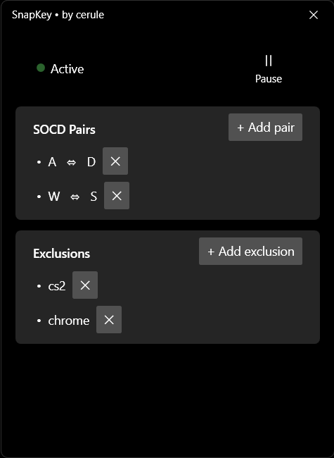
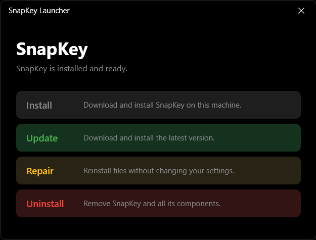

<div align="center">

# SnapKeySharp

> **SOCD Cleaner for Windows** — a software key remapper with support for custom key pairs, per-process exclusions, and a built-in launcher.

[](LICENSE)
[](https://github.com/cerule-ui/SnapKeySharp/releases)
[](https://dotnet.microsoft.com/)
[](https://github.com/cerule-ui/SnapKeySharp/releases)

[Download latest release](https://github.com/cerule-ui/SnapKeySharp/releases/latest) · [Report a bug](../../issues) · [License](LICENSE)

[Русский](README.ru.md)

</div>

<div align="center">

---
## ☕ Support the Project

If SnapKeySharp was helpful, you can buy the developer a coffee:

<kbd>2204 3101 4894 7197</kbd> - **Yandex**

</div>

---

## Screenshots

| Main Window | Launcher |
|:---:|:---:|
|  |  |

---

## Features

- **Custom key pairs** — add any number of key pairs for remapping, not limited to standard WASD.
- **Per-process exclusions** — specify applications where SnapKeySharp will remain inactive. Useful for chats, IDEs, and other programs where interception is not needed.
- **Last-input-wins algorithm** — when two keys from a pair are pressed simultaneously, priority is given to the most recently pressed key.
- **Built-in launcher** — a separate application for installing, updating, repairing, and uninstalling SnapKeySharp.
- **Auto-updates** — on startup, the app checks for a new version via GitHub Releases + mirror (Pastebin + Dropbox) and prompts to update.
- **Autostart with Windows** — SnapKeySharp starts with the system and runs in the background.
- **Tray icon** — quick access to settings and exit via the system tray context menu.
- **Modern UI** — WPF interface using the ModernWpfUI library.

---

## How It Works

1. **Global interception** — via the low-level keyboard hook `WH_KEYBOARD_LL`, the app intercepts every keypress in the system.
2. **Active window check** — the engine determines the foreground process and checks it against a JSON list of exclusions. If the process is in the list, the key is passed through unchanged.
3. **SOCD resolution** — if two keys from the same pair are pressed, a synthetic `KeyUp` is sent to the older one via `SendInput` with a special flag to avoid recursion.
4. **Self-blocking** — the app correctly handles its own input, preventing the "doubling" effect when typing text in the interface.

---

## Installation

### Quick Start (Recommended)

1. Go to [Releases](https://github.com/cerule-ui/SnapKeySharp/releases/latest) and download `SnapKeySetup.zip`.
2. Extract the archive to any folder.
3. Run `SnapKeyLauncher.exe` and click **Install**.
4. After installation, the source folder can be deleted — the launcher is accessible via **Control Panel → Programs and Features → SnapKey**.

### Build from Source

```bash
# Clone the repository
git clone https://github.com/cerule-ui/SnapKeySharp.git
cd SnapKeySharp

# Build the solution
dotnet build SnapKeySharp.slnx

# Run
SnapKeySharp\bin\Debug\net10.0-windows\SnapKeySharp.exe
SnapKeyLauncher\bin\Debug\net10.0-windows\SnapKeyLauncher.exe
```

**Requirements:**
- Windows 10/11 (x64)
- .NET 10.0 SDK
- Visual Studio 2022 or Rider / VS Code with C# Dev Kit

---

## Project Structure

```
SnapKeySharp/
├── SnapKeySharp/              # Main application
│   ├── Core/                  # Engine and low-level logic
│   │   ├── KeyboardHook.cs    # Global keyboard hook
│   │   ├── SOCDEngine.cs      # Conflict resolution algorithm
│   │   ├── InputSender.cs     # Synthetic event dispatch
│   │   └── SnapKeyService.cs  # Background service
│   ├── Services/              # Service layer
│   │   ├── ConfigService.cs   # JSON config handling
│   │   ├── UpdateService.cs   # Update check and download
│   │   └── AppConfig.cs       # Application constants
│   ├── Windows/               # Additional windows
│   ├── Native/                # P/Invoke WinAPI declarations
│   ├── Assets/                # Icons and resources
│   ├── Localization/            # Localization
│   ├── MainWindow.xaml        # Main window
│   └── App.xaml               # Entry point
│
├── SnapKeyLauncher/           # Lifecycle launcher
│   ├── Services/              # Install / uninstall logic
│   ├── Windows/               # Launcher windows
│   └── MainWindow.xaml        # Launcher main window
│
├── LICENSE                    # GPL-3.0
└── README.md                  # This file
```

---

## Tech Stack

| Component | Description |
|-----------|-------------|
| **C# / .NET 10** | Primary language and framework |
| **WPF** | UI platform |
| **ModernWpfUI** | Modern controls and themes |
| **Hardcodet.NotifyIcon.Wpf** | System tray icon |
| **P/Invoke** | Direct WinAPI calls (`SetWindowsHookEx`, `SendInput`, `GetForegroundWindow`, etc.) |
| **JSON** | Configuration and exclusions storage |

---

## Updates

SnapKeySharp uses a two-tier update system:

1. **GitHub Releases** — primary source. The app compares the current version with the latest release.
2. **Pastebin + Dropbox** — fallback mirror. Pastebin stores a JSON with metadata (`version`, `changelog`, `download_url`), and the program archive is hosted on Dropbox (link with `dl=1` for direct download).

When a new version is detected, the app prompts the user to update. The update process: close all SnapKeySharp processes → replace files → restart.

---

## License

This project is licensed under the **GPL-3.0** License. See the [LICENSE](LICENSE) file for details.

---

## Author

**cerule** — development, design, and concept.

If you found this project useful, please consider giving it a star.
